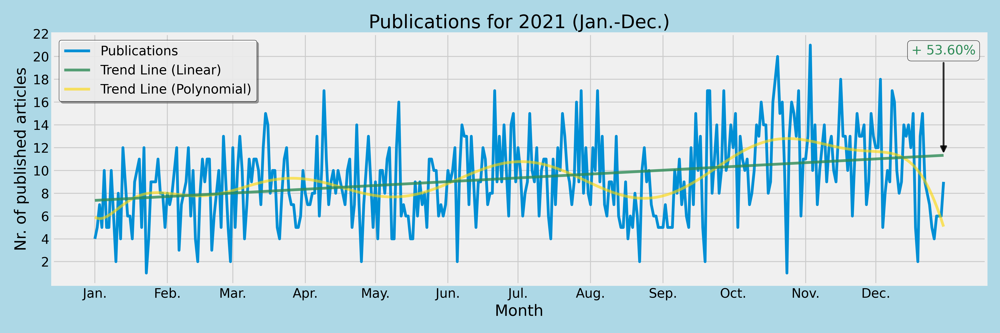
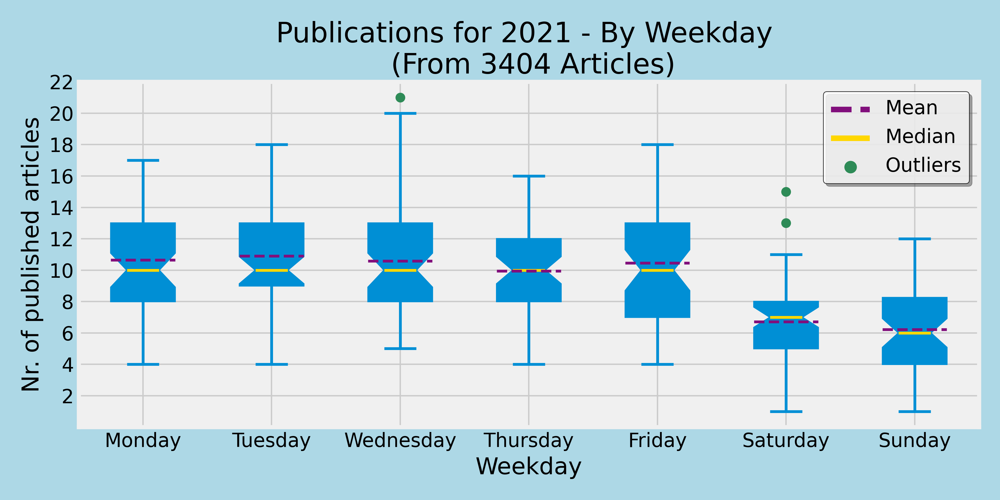
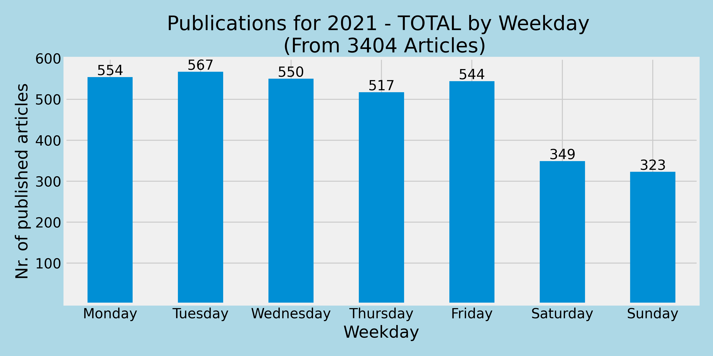
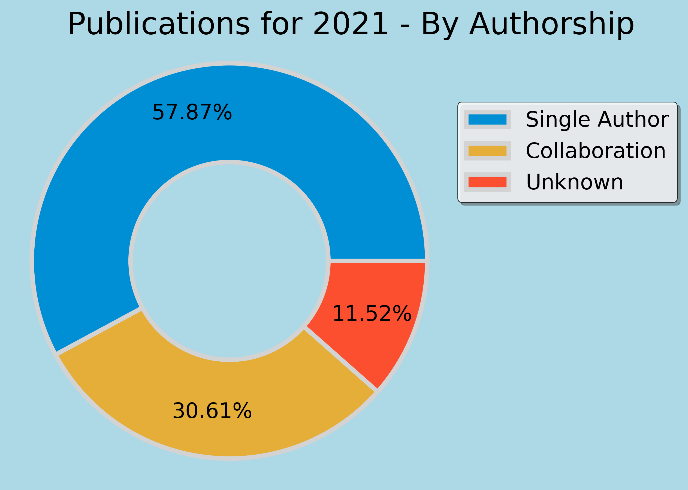
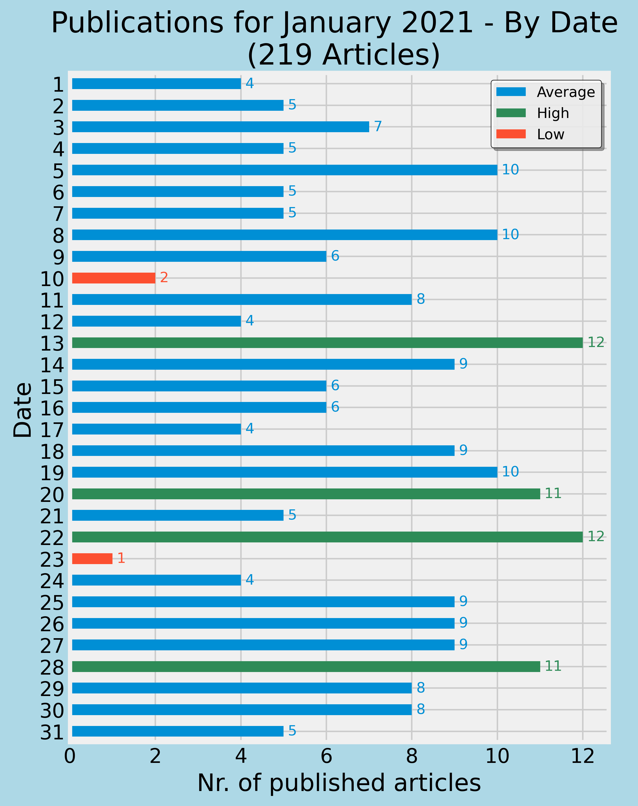

# data_analysis_CNN_news

## Summary
The goal of this project is to analyze [previously collected data](https://github.com/vollenia/web_scraper-CNN_news) from the the CNN (Cable News Network) website for the year of 2021. The focus of this analysis lies not on the contents of the articles themselves (although, it is very much possible and of intereset to be performed in the future) but on the meta information of these articles.
The analysis is performed in Python 3.8.10 and presented in a Jupyter notebook format.

## Insights
This serves as an overview of the results from the performed analysis. Short chapters display most notable insights accompanied by some context-providing commentary.

### Progression Throughout the Year

  

Taking a look at the progression of publications throughout the year first, we observe a degree of fluctuation in the number of publications. The yellow trend line is used to visualize this fluctuation further by performing polynomial regression on the data. Despite this fluctuation, we can observe a steady growth in productivity throughout the year as visualized by the green trend line utilizing linear regression. Inspecting this line, we can observe a substantial increase of 53.60% at the end of the year. When this analysis was originally performed using only data from January to November the prediction for the end of the year amounted to over 60%. The strong drop off in publications in December (especially in the second half of the month, which is presumably correlated with the holiday season) resulted in a downwards adjustment of the overall positive trend by around 10%.

### Weekly Perspective

  

Viewing the reporting on news as a recurring "workweek" event throughout the year, it becomes of interest to inspect the contribution of the individual days to the overall picture. 
We make the most notable observation when inspecting the regular workdays and the weekend. Monday through Friday display a slightly variating mean of around 10 to 11 and an identical median of 10. When moving to the weekend, we observe a significant decrease to a mean of 6 to 7 and a median of 7 for Saturday and 6 for Sunday as well as an overall decrease in publications. The total publication counts for each weekday are, however, best visualized in a standalone graph.

  

### Authorship Distribution

  

To get a sense of how these publications came to be, it is of interest to inspect their authorship. Given the large number of journalists working for CNN, we don't want to look at every single one individually but group them together. In this context it seems of particular interest to examine the spirit of collaboration in a journalistic environment. Therefore, we make the distinction between a single person worked on an article and a group of people contributing to its content. Additionally, articles which don't contain a reference and where the author is therefore unknown are also included.

Inspecting the chart, we observe a relationship of almost 2 to 1 in favor of individual work. At this point, jumping to the conclusion that CNN journalists are not particularly fond of each other would likely, on its own, make for some flashy headlines that would definitely find their target audience... A more subjective interpretation of these insights, however, is that, for most day-to-day news reports, one journalist is enough.

### Monthly Close-Up

  

While the analysis described so far focused on data collected over the whole year, we can also inspect each month individually.
This is exemplified on the month of January.
In this chart we can see the publication counts for each day of the month. An average range for this month is computed by utilizing the mean value and the standard deviation. Days on which the number of published articles lays within this range are displayed in blue while positive outliers are green and the negative red.
Knowing that the first day of 2021 was a Friday we infer that the two days marked as red, the 10th and the 23rd were a Sunday and Saturday, respectively. Taking the insights from the previous analysis of individual weekdays into account, we know that this observation is nothing out of the ordinary.
